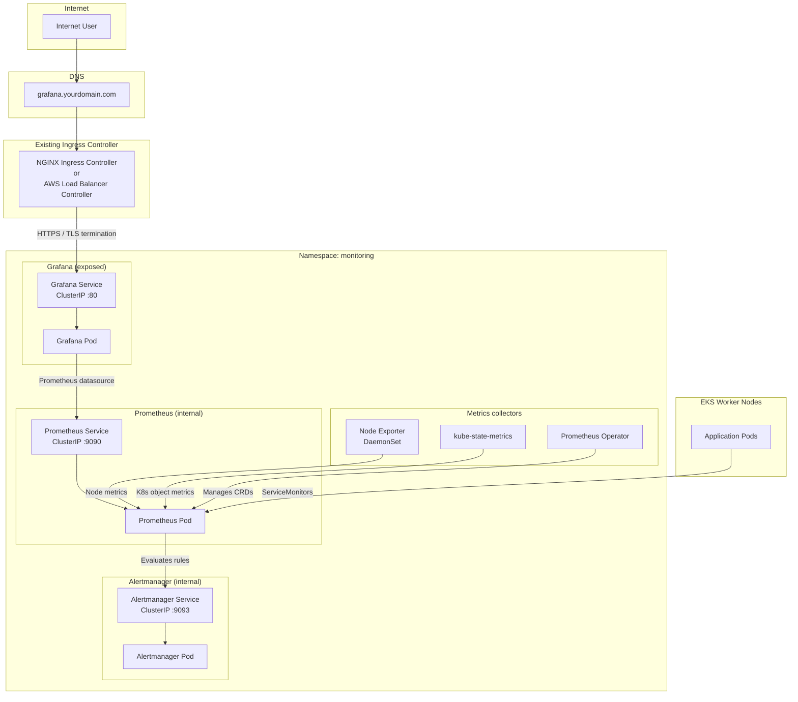
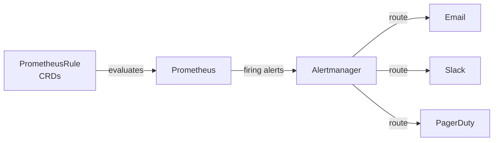
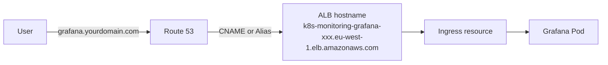

# EKS Monitoring Stack with Prometheus & Grafana

Production-grade observability for Amazon EKS using the [kube-prometheus-stack](https://github.com/prometheus-community/helm-charts/tree/main/charts/kube-prometheus-stack) Helm chart. This deployment integrates with an **existing Ingress Controller** (NGINX Ingress Controller or AWS Load Balancer Controller) and exposes **only Grafana** to the internet—a secure, operationally proven pattern used across enterprise Kubernetes environments.

---

## Table of Contents

- [Overview](#overview)
- [Architecture](#architecture)
- [Solution Components](#solution-components)
- [Prerequisites](#prerequisites)
- [Namespace Strategy](#namespace-strategy)
- [Configuration File](#configuration-file)
- [Grafana Configuration](#grafana-configuration)
- [Ingress Configuration](#ingress-configuration)
- [Prometheus Configuration](#prometheus-configuration)
- [Alertmanager Configuration](#alertmanager-configuration)
- [Installation Guide](#installation-guide)
- [Verification Guide](#verification-guide)
- [DNS Configuration](#dns-configuration)
- [Accessing Grafana](#accessing-grafana)
- [Accessing Prometheus Securely](#accessing-prometheus-securely)
- [Default Dashboards](#default-dashboards)
- [Default Alerting Rules](#default-alerting-rules)
- [Security Best Practices](#security-best-practices)
- [Troubleshooting](#troubleshooting)
- [Scaling Recommendations](#scaling-recommendations)
- [Future Enhancements](#future-enhancements)
- [Conclusion](#conclusion)

---

## Overview

### Why monitoring matters in Kubernetes

Kubernetes workloads are dynamic—pods are created, rescheduled, and terminated continuously. Without observability, failures surface only when users report them. A monitoring stack provides:

- **Proactive detection** of node pressure, pod crashes, and resource saturation
- **Capacity planning** based on historical metrics
- **Incident response** with correlated logs, metrics, and alerts
- **SLO/SLA tracking** for production services

### Why Prometheus and Grafana

| Tool | Role | Industry adoption |
|------|------|-------------------|
| **Prometheus** | Time-series metrics collection, alerting rules engine | CNCF graduated project; de facto Kubernetes metrics standard |
| **Grafana** | Visualization, dashboards, unified observability UI | Used by thousands of enterprises for operational dashboards |

The `kube-prometheus-stack` chart bundles the **Prometheus Operator**, exporters, default dashboards, and alerting rules into a single, maintained deployment.

### Why expose only Grafana through Ingress

> **Security principle:** Minimize the attack surface.

| Component | Exposure | Rationale |
|-----------|----------|-----------|
| Grafana | Public (via Ingress + TLS) | Designed for authenticated human access; supports RBAC and SSO |
| Prometheus | Internal only | Powerful query API; no built-in multi-tenant auth in default setup |
| Alertmanager | Internal only | Can trigger notifications; should not be internet-reachable |

Exposing Prometheus or Alertmanager publicly without additional authentication layers is a common misconfiguration that leads to data leaks and unauthorized alert manipulation.

### Benefits of reusing an existing Ingress Controller

- **No additional Load Balancer cost** — ALB/NLB charges apply per load balancer; sharing one controller amortizes cost
- **Unified TLS management** — Reuse ACM certificates and DNS patterns already in place
- **Consistent security posture** — Same WAF, security groups, and routing policies as application traffic
- **Simpler operations** — One ingress class, one controller to patch and monitor

---

## Architecture



### Traffic flow

1. **User → Grafana:** Browser resolves `grafana.yourdomain.com` to the existing Ingress endpoint (ALB hostname or NGINX external IP). TLS terminates at the Ingress Controller. Traffic is forwarded to the Grafana `Service` on port 80 inside the `monitoring` namespace.

2. **Grafana → Prometheus:** Grafana queries Prometheus over the **internal** ClusterIP service (`http://kube-prometheus-stack-prometheus.monitoring.svc:9090`). This traffic never leaves the cluster.

3. **Prometheus → targets:** Prometheus scrapes Node Exporter (per-node), kube-state-metrics (cluster state), and any `ServiceMonitor`/`PodMonitor` resources across namespaces.

4. **Prometheus → Alertmanager:** When alerting rules fire, Prometheus sends alerts to Alertmanager internally. Alertmanager deduplicates, groups, and routes notifications (email, Slack, PagerDuty—configured separately).

5. **Admin access to Prometheus/Alertmanager:** Operators use `kubectl port-forward` for ad-hoc queries and alert debugging—no public exposure required.

---

## Solution Components

| Component | Purpose |
|-----------|---------|
| **Prometheus Operator** | Kubernetes operator that manages Prometheus, Alertmanager, and related CRDs (`Prometheus`, `ServiceMonitor`, `PodMonitor`, `PrometheusRule`, `AlertmanagerConfig`) |
| **Prometheus** | Time-series database that scrapes and stores metrics; evaluates alerting rules; provides PromQL query API |
| **Alertmanager** | Receives alerts from Prometheus; handles grouping, inhibition, silencing, and notification routing |
| **Grafana** | Web UI for dashboards, visualization, and exploration; authenticates users; queries Prometheus as a datasource |
| **kube-state-metrics** | Exposes Kubernetes object state metrics (deployments, pods, nodes, PVCs) as Prometheus metrics |
| **Node Exporter** | DaemonSet that exposes hardware and OS metrics (CPU, memory, disk, network) from each node |

---

## Prerequisites

| Requirement | Description |
|-------------|-------------|
| **AWS EKS cluster** | Running cluster with worker nodes (e.g. `cdec-eks-dev`) |
| **kubectl** | Configured to access the cluster (`aws eks update-kubeconfig`) |
| **Helm v3** | `helm version` shows v3.x |
| **Existing Ingress Controller** | NGINX Ingress Controller **or** AWS Load Balancer Controller already installed and functional |
| **StorageClass** | Dynamic volume provisioning (e.g. `gp2`, `gp3`, `ebs-sc`) for Prometheus/Grafana PVCs |
| **DNS domain** | Owned domain for Grafana hostname (e.g. `grafana.yourdomain.com`) |
| **ACM certificate** | TLS certificate for Grafana hostname (ALB: same region as cluster; CloudFront not applicable here) |

### Validation commands

```bash
# Cluster connectivity
kubectl cluster-info
kubectl get nodes

# Helm
helm version

# Ingress Controller — ALB
kubectl get deployment -n kube-system aws-load-balancer-controller
kubectl get ingressclass alb

# Ingress Controller — NGINX
kubectl get deployment -n ingress-nginx ingress-nginx-controller
kubectl get ingressclass nginx

# StorageClass
kubectl get storageclass

# Default StorageClass should show (default) in the NAME column
kubectl get storageclass -o jsonpath='{.items[?(@.metadata.annotations.storageclass\.kubernetes\.io/is-default-class=="true")].metadata.name}{"\n"}'
```

> **Tip:** If no default StorageClass exists, set `storageClassName` explicitly in `monitoring-values.yaml` for Grafana and Prometheus PVCs.

---

## Namespace Strategy

All monitoring resources are deployed in the **`monitoring`** namespace.

| Reason | Explanation |
|--------|-------------|
| **Isolation** | Separates observability workloads from application namespaces (`default`, `kube-system`, etc.) |
| **RBAC** | Enables namespace-scoped roles for monitoring team vs. application developers |
| **Resource quotas** | Apply CPU/memory/storage limits to the monitoring stack without affecting apps |
| **NetworkPolicies** | Restrict ingress to Grafana only within a well-defined boundary |
| **Lifecycle management** | Uninstall or upgrade the entire stack with `helm uninstall -n monitoring` |

The Prometheus Operator is configured to discover `ServiceMonitor` and `PodMonitor` resources **cluster-wide**, so application teams can expose metrics from any namespace while the stack itself lives in `monitoring`.

---

## Configuration File

The file [`monitoring-values.yaml`](monitoring-values.yaml) overrides default chart values for a production EKS deployment. Install with:

```bash
helm upgrade --install kube-prometheus-stack prometheus-community/kube-prometheus-stack \
  -n monitoring --create-namespace \
  -f monitoring-values.yaml
```

### Major configuration blocks

| Block | Purpose | Key settings |
|-------|---------|--------------|
| **Grafana** | Dashboard UI, Ingress exposure | `adminUser`, `persistence`, `ingress`, `resources` |
| **Prometheus** | Metrics storage and scraping | `retention`, `storageSpec`, `resources`, selectors |
| **Alertmanager** | Alert routing | `storage`, `resources`, receivers (customize post-install) |
| **Storage** | Persistent volumes | PVC size, `storageClassName`, access modes |
| **Resources** | CPU/memory guarantees | `requests` and `limits` per component |
| **Ingress** | External Grafana access | `ingressClassName`, annotations, TLS hosts |
| **Retention** | Data retention policy | `prometheus.prometheusSpec.retention` (default: `15d`) |

---

## Grafana Configuration

### Admin credentials

| Setting | Value | Notes |
|---------|-------|-------|
| `grafana.adminUser` | `admin` | Change only if integrating SSO |
| `grafana.adminPassword` | Set in values or secret | **Never commit real passwords to Git** |

**Recommended:** Store the password in a Kubernetes secret and reference it:

```yaml
grafana:
  admin:
    existingSecret: grafana-admin-credentials
    userKey: admin-user
    passwordKey: admin-password
```

```bash
kubectl create secret generic grafana-admin-credentials -n monitoring \
  --from-literal=admin-user=admin \
  --from-literal=admin-password='YOUR_STRONG_PASSWORD'
```

### Persistence

Grafana dashboards, users, and settings persist to a PVC:

```yaml
grafana:
  persistence:
    enabled: true
    size: 10Gi
    storageClassName: gp3   # optional — uses default StorageClass if omitted
```

### Ingress and TLS

```yaml
grafana:
  ingress:
    enabled: true
    ingressClassName: alb          # or nginx
    hosts:
      - grafana.yourdomain.com
    path: /
    pathType: Prefix
    tls:
      - hosts:
          - grafana.yourdomain.com
```

### DNS hostname

Replace `grafana.yourdomain.com` with your FQDN. Example for this project:

```text
grafana.thecloudnine.in
```

---

## Ingress Configuration

Grafana is the **only** component with Ingress enabled. Prometheus and Alertmanager remain ClusterIP services.

### NGINX Ingress example

```yaml
grafana:
  ingress:
    enabled: true
    ingressClassName: nginx
    hosts:
      - grafana.yourdomain.com
    path: /
    pathType: Prefix
    annotations:
      nginx.ingress.kubernetes.io/ssl-redirect: "true"
      nginx.ingress.kubernetes.io/force-ssl-redirect: "true"
      nginx.ingress.kubernetes.io/backend-protocol: "HTTP"
      nginx.ingress.kubernetes.io/proxy-body-size: "10m"
      # cert-manager (optional):
      # cert-manager.io/cluster-issuer: letsencrypt-prod
    tls:
      - secretName: grafana-tls
        hosts:
          - grafana.yourdomain.com
```

| Annotation | Purpose |
|------------|---------|
| `ingressClassName: nginx` | Routes to NGINX Ingress Controller |
| `ssl-redirect` | Redirects HTTP → HTTPS |
| `backend-protocol: HTTP` | Grafana pod speaks HTTP; TLS terminates at NGINX |

> **Note:** With cert-manager, omit manual TLS secret creation. Without cert-manager, create a TLS secret or terminate TLS at a cloud load balancer in front of NGINX.

### AWS ALB example

Aligns with AWS Load Balancer Controller patterns (same as application Ingress in this repo):

```yaml
grafana:
  ingress:
    enabled: true
    ingressClassName: alb
    hosts:
      - grafana.yourdomain.com
    path: /
    pathType: Prefix
    annotations:
      alb.ingress.kubernetes.io/scheme: internet-facing
      alb.ingress.kubernetes.io/target-type: ip
      alb.ingress.kubernetes.io/backend-protocol: HTTP
      alb.ingress.kubernetes.io/healthcheck-path: /api/health
      alb.ingress.kubernetes.io/healthcheck-interval-seconds: "30"
      alb.ingress.kubernetes.io/healthcheck-timeout-seconds: "5"
      alb.ingress.kubernetes.io/healthy-threshold-count: "2"
      alb.ingress.kubernetes.io/unhealthy-threshold-count: "3"
      alb.ingress.kubernetes.io/listen-ports: '[{"HTTP":80},{"HTTPS":443}]'
      alb.ingress.kubernetes.io/ssl-redirect: "443"
      alb.ingress.kubernetes.io/certificate-arn: arn:aws:acm:eu-west-1:ACCOUNT_ID:certificate/CERT_ID
      alb.ingress.kubernetes.io/ssl-policy: ELBSecurityPolicy-TLS-1-2-2017-01
```

| Annotation | Purpose |
|------------|---------|
| `ingressClassName: alb` | Routes to AWS Load Balancer Controller |
| `target-type: ip` | Registers pod IPs directly (required for Fargate/IP mode) |
| `scheme: internet-facing` | Public ALB (use `internal` for VPN-only access) |
| `healthcheck-path` | Grafana health endpoint (`/api/health`) |
| `listen-ports` | HTTP + HTTPS listeners |
| `certificate-arn` | ACM certificate for TLS termination |
| `ssl-redirect` | Redirect HTTP to HTTPS on port 443 |

> **Warning:** Sharing one ALB across multiple Ingress resources is supported via IngressGroup annotations. If your application already uses a named ALB, add `alb.ingress.kubernetes.io/group.name` to merge Grafana onto the same load balancer—or use a dedicated ALB for monitoring isolation.

---

## Prometheus Configuration

### Retention: 15 days

```yaml
prometheus:
  prometheusSpec:
    retention: 15d
    retentionSize: 45GB   # optional hard cap — evicts oldest data when exceeded
```

Fifteen days balances operational visibility with storage cost. Increase for compliance or trend analysis; decrease for dev clusters.

### Storage requirements

| Setting | Recommended (small prod) | Notes |
|---------|--------------------------|-------|
| PVC size | 50 Gi | ~3–5 GB per million active series per 15 days (varies by scrape interval) |
| StorageClass | `gp3` | EBS volumes; ensure zone affinity with pods |

```yaml
prometheus:
  prometheusSpec:
    storageSpec:
      volumeClaimTemplate:
        spec:
          accessModes: ["ReadWriteOnce"]
          resources:
            requests:
              storage: 50Gi
          storageClassName: gp3
```

### Resource requests and limits

```yaml
prometheus:
  prometheusSpec:
    resources:
      requests:
        cpu: 500m
        memory: 2Gi
      limits:
        cpu: 2
        memory: 4Gi
```

### Why Prometheus is not exposed publicly

- PromQL API allows full metric enumeration—often includes labels with sensitive metadata
- No native enterprise SSO in vanilla Prometheus
- `kubectl port-forward` provides secure, auditable admin access
- Grafana serves as the sanctioned query and visualization layer for broader teams

---

## Alertmanager Configuration

Alertmanager runs **internally** with a ClusterIP service on port `9093`.

### Alerting workflow



### Port-forward access

```bash
# Alertmanager UI
kubectl port-forward -n monitoring svc/kube-prometheus-stack-alertmanager 9093:9093
```

Open [http://localhost:9093](http://localhost:9093) to view active alerts, silences, and routing status.

### Post-install: configure receivers

Edit the Alertmanager secret or use an `AlertmanagerConfig` CRD to add notification channels. Default install includes a minimal configuration—customize before relying on production alerting.

---

## Installation Guide

### Step 1 — Add Helm repository

```bash
helm repo add prometheus-community https://prometheus-community.github.io/helm-charts
```

### Step 2 — Update repository

```bash
helm repo update
```

### Step 3 — Create monitoring namespace

```bash
kubectl create namespace monitoring
```

> **Note:** `--create-namespace` on the install command also creates it; explicit creation is optional but documents intent.

### Step 4 — Customize values

Edit [`monitoring-values.yaml`](monitoring-values.yaml):

1. Set `grafana.adminPassword` or use an existing secret
2. Set `grafana.ingress.hosts` to your FQDN
3. Set ALB/NGINX annotations (certificate ARN, etc.)
4. Confirm `storageClassName` if no default exists

### Step 5 — Install chart

```bash
helm upgrade --install kube-prometheus-stack prometheus-community/kube-prometheus-stack \
  --namespace monitoring \
  --create-namespace \
  -f monitoring-values.yaml \
  --wait \
  --timeout 15m
```

### Step 6 — Verify deployment

```bash
kubectl get pods -n monitoring
kubectl get svc -n monitoring
kubectl get ingress -n monitoring
```

---

## Verification Guide

### Pods

All pods should be `Running` (or `Completed` for init jobs):

```bash
kubectl get pods -n monitoring -o wide
```

Expected workloads (names may vary slightly by chart version):

| Pod prefix | Status |
|------------|--------|
| `kube-prometheus-stack-grafana-*` | Running |
| `prometheus-kube-prometheus-stack-prometheus-0` | Running |
| `alertmanager-kube-prometheus-stack-alertmanager-0` | Running |
| `kube-prometheus-stack-operator-*` | Running |
| `kube-prometheus-stack-kube-state-metrics-*` | Running |
| `kube-prometheus-stack-prometheus-node-exporter-*` | Running (one per node) |

```bash
# Watch until all ready
kubectl wait --for=condition=Ready pods --all -n monitoring --timeout=600s
```

### Services

```bash
kubectl get svc -n monitoring
```

| Service | Type | Port | Exposure |
|---------|------|------|----------|
| `kube-prometheus-stack-grafana` | ClusterIP | 80 | Via Ingress |
| `kube-prometheus-stack-prometheus` | ClusterIP | 9090 | Internal |
| `kube-prometheus-stack-alertmanager` | ClusterIP | 9093 | Internal |

### Ingress

```bash
kubectl get ingress -n monitoring
kubectl describe ingress -n monitoring
```

For ALB, note the `ADDRESS` field (ALB hostname). For NGINX, note the external IP or hostname.

### Persistent Volumes

```bash
kubectl get pvc -n monitoring
kubectl get pv
```

All PVCs should be `Bound`. If `Pending`, see [Troubleshooting](#troubleshooting).

### End-to-end health check

```bash
# Grafana health (via port-forward before DNS is configured)
kubectl port-forward -n monitoring svc/kube-prometheus-stack-grafana 3000:80
curl -s http://localhost:3000/api/health

# Prometheus targets (via port-forward)
kubectl port-forward -n monitoring svc/kube-prometheus-stack-prometheus 9090:9090
curl -s http://localhost:9090/-/healthy
```

---

## DNS Configuration

After Ingress is created, point your Grafana hostname to the Ingress endpoint.



### Retrieve Ingress endpoint

**ALB (AWS Load Balancer Controller):**

```bash
kubectl get ingress -n monitoring -o jsonpath='{.items[0].status.loadBalancer.ingress[0].hostname}{"\n"}'
```

**NGINX:**

```bash
kubectl get ingress -n monitoring -o jsonpath='{.items[0].status.loadBalancer.ingress[0].ip}{"\n"}'
# or .hostname for cloud LB fronting NGINX
```

### Route 53 CNAME record

| Field | Value |
|-------|-------|
| Record name | `grafana` |
| Record type | `CNAME` (or Alias to ALB for lower latency) |
| Value | ALB hostname from previous command |
| TTL | 300 |

**AWS CLI example:**

```bash
ALB_HOST=$(kubectl get ingress -n monitoring -o jsonpath='{.items[0].status.loadBalancer.ingress[0].hostname}')
echo "Create CNAME: grafana.yourdomain.com -> ${ALB_HOST}"
```

**Alias record (recommended for ALB):**

```bash
# In Route 53 console: Alias to Application Load Balancer, select region and ALB
```

### Verify DNS propagation

```bash
dig +short grafana.yourdomain.com
curl -I https://grafana.yourdomain.com/api/health
```

---

## Accessing Grafana

| Item | Value |
|------|-------|
| **URL** | `https://grafana.yourdomain.com` |
| **Default username** | `admin` |
| **Password** | Value set in `monitoring-values.yaml` or Kubernetes secret |

### First login

1. Navigate to `https://grafana.yourdomain.com`
2. Log in with `admin` / your configured password
3. Grafana may prompt to change the password on first login—**accept and set a strong password**

### Password rotation

```bash
# Update secret
kubectl create secret generic grafana-admin-credentials -n monitoring \
  --from-literal=admin-user=admin \
  --from-literal=admin-password='NEW_STRONG_PASSWORD' \
  --dry-run=client -o yaml | kubectl apply -f -

# Restart Grafana to pick up changes (if using existingSecret)
kubectl rollout restart deployment -n monitoring -l app.kubernetes.io/name=grafana
```

> **Recommendation:** Rotate the Grafana admin password on first deploy and quarterly thereafter. Prefer SSO (OAuth, SAML) for team access in production—see [Future Enhancements](#future-enhancements).

---

## Accessing Prometheus Securely

Use `kubectl port-forward` for administrative access. Traffic is tunneled over the Kubernetes API—authenticated via your AWS IAM / EKS access configuration.

### Prometheus UI and PromQL

```bash
kubectl port-forward -n monitoring svc/kube-prometheus-stack-prometheus 9090:9090
```

Open [http://localhost:9090](http://localhost:9090) — explore targets, graph metrics, and debug queries.

### Alertmanager UI

```bash
kubectl port-forward -n monitoring svc/kube-prometheus-stack-alertmanager 9093:9093
```

Open [http://localhost:9093](http://localhost:9093).

### Why port-forward is preferred for production

| Approach | Risk level | Use case |
|----------|------------|----------|
| Public Ingress to Prometheus | **High** | Not recommended |
| VPN + internal LB | Medium | Large enterprises with private connectivity |
| `kubectl port-forward` | **Low** | Admin debugging, on-call investigation |
| Grafana datasource | **Low** | Day-to-day dashboards for all users |

---

## Default Dashboards

The chart installs Grafana dashboards via ConfigMaps. After login, browse **Dashboards → Browse**.

| Dashboard | Folder | What it shows |
|-----------|--------|---------------|
| **Kubernetes / Compute Resources / Cluster** | Kubernetes | Cluster-wide CPU, memory, network utilization |
| **Kubernetes / Compute Resources / Namespace (Pods)** | Kubernetes | Per-namespace pod resource usage |
| **Kubernetes / Compute Resources / Node (Pods)** | Kubernetes | Pods scheduled per node |
| **Kubernetes / Kubelet** | Kubernetes | Kubelet operations, pod lifecycle latency |
| **Node Exporter / Nodes** | Node Exporter | Per-node hardware metrics (CPU, memory, disk, network) |
| **Kubernetes / Networking / Cluster** | Kubernetes | Network I/O, drops, DNS |
| **Kubernetes / Persistent Volumes** | Kubernetes | PVC usage, volume stats |
| **Prometheus / Overview** | Prometheus | Prometheus health, scrape stats, TSDB status |
| **Alertmanager / Overview** | Alertmanager | Alert volume, notification latency |

### What operators should monitor first

1. **Node Exporter / Nodes** — node-level saturation before pod scheduling fails
2. **Kubernetes / Compute Resources / Namespace** — identify noisy neighbor namespaces
3. **Prometheus / Overview** — ensure scraping is healthy (targets up, no compaction errors)

---

## Default Alerting Rules

The chart ships `PrometheusRule` CRDs with common alerts (exact names vary by chart version). Review with:

```bash
kubectl get prometheusrules -n monitoring
```

| Alert | Severity | Meaning |
|-------|----------|---------|
| **NodeDown** / `KubeNodeNotReady` | critical | Node not reporting Ready status |
| **PodCrashLooping** / `KubePodCrashLooping` | warning | Pod restarting repeatedly |
| **HighCPU** / `CPUThrottlingHigh` | warning | Container CPU throttling |
| **HighMemory** / `KubeMemoryOvercommit` | warning | Memory pressure or overcommit |
| **DiskPressure** / `KubeNodeDiskPressure` | warning | Node disk running low |
| **Control plane** / `KubeAPIDown` | critical | API server unreachable (self-hosted only; limited on EKS managed control plane) |

### View active alerts

```bash
# Via port-forward
kubectl port-forward -n monitoring svc/kube-prometheus-stack-prometheus 9090:9090
# Open http://localhost:9090/alerts
```

> **Note:** EKS manages the control plane—some control-plane alerts may not apply or may require [CloudWatch metrics](https://docs.aws.amazon.com/eks/latest/userguide/control-plane-logs.html) instead.

---

## Security Best Practices

| Practice | Implementation |
|----------|----------------|
| **Do not expose Prometheus publicly** | No Ingress; ClusterIP only; admin via port-forward |
| **Do not expose Alertmanager publicly** | Same as Prometheus |
| **Use TLS for Grafana** | ACM cert on ALB, or cert-manager with NGINX |
| **Rotate Grafana admin password** | Secret-based credentials; force change on first login |
| **Restrict Ingress with WAF (ALB)** | Attach AWS WAF ACL to ALB for rate limiting and geo blocking |
| **NetworkPolicies** | Allow Ingress → Grafana only; deny cross-namespace egress where possible |
| **IRSA** | Use IAM Roles for Service Accounts if Grafana/Prometheus need AWS API access |
| **RBAC** | Limit who can `kubectl port-forward` to monitoring namespace |
| **Secrets in Git** | Never commit `adminPassword`; use External Secrets Operator or SSM Parameter Store |
| **Grafana anonymous auth** | Keep disabled (`grafana.ini` / chart values) |

### Example NetworkPolicy (Grafana ingress only)

```yaml
apiVersion: networking.k8s.io/v1
kind: NetworkPolicy
metadata:
  name: grafana-ingress-only
  namespace: monitoring
spec:
  podSelector:
    matchLabels:
      app.kubernetes.io/name: grafana
  policyTypes:
    - Ingress
  ingress:
    - from:
        - namespaceSelector:
            matchLabels:
              kubernetes.io/metadata.name: kube-system   # adjust for your ingress controller namespace
```

---

## Troubleshooting

| Problem | Possible cause | Resolution |
|---------|----------------|------------|
| Pods not starting | Insufficient node resources | `kubectl describe pod -n monitoring <pod>` — check events; scale node group |
| Pods `CrashLoopBackOff` | Wrong config, OOM | Check logs: `kubectl logs -n monitoring <pod> --previous` |
| PVC `Pending` | No StorageClass / zone mismatch | `kubectl describe pvc -n monitoring`; set `storageClassName`; ensure nodes in same AZ as EBS |
| Ingress has no ADDRESS | Controller not running / wrong class | Verify controller pods; confirm `ingressClassName` matches (`alb` or `nginx`) |
| DNS not resolving | CNAME not created / propagation | `dig grafana.yourdomain.com`; verify Route 53 record |
| Grafana 502/503 | Health check path wrong (ALB) | Set `healthcheck-path: /api/health`; verify target group healthy |
| Grafana login failure | Wrong password / secret not mounted | Verify secret keys; check `grafana-admin` env in pod |
| Prometheus storage full | Retention too long / high cardinality | Increase PVC; reduce `retention`; drop high-cardinality labels |
| Prometheus targets down | NetworkPolicy / wrong ServiceMonitor | Check **Status → Targets** in Prometheus UI |
| ALB certificate error | Wrong ACM region or ARN | ACM cert must be in same region as ALB (eu-west-1 for EKS in eu-west-1) |
| Helm install timeout | Large cluster, slow pulls | Increase `--timeout`; pre-pull images on nodes |

### Diagnostic commands

```bash
# Events in monitoring namespace
kubectl get events -n monitoring --sort-by='.lastTimestamp' | tail -20

# Grafana logs
kubectl logs -n monitoring -l app.kubernetes.io/name=grafana --tail=100

# Prometheus operator logs
kubectl logs -n monitoring -l app.kubernetes.io/name=prometheus-operator --tail=100

# Describe failing pod
kubectl describe pod -n monitoring <pod-name>
```

---

## Scaling Recommendations

| Environment | Nodes | Prometheus CPU/RAM | Prometheus storage | Grafana | Alertmanager |
|-------------|-------|-------------------|-------------------|---------|--------------|
| **Single-node / dev** | 1 | 250m / 1 Gi | 20 Gi | 100m / 256 Mi | 50m / 128 Mi |
| **Small production** | 2–3 | 500m / 2 Gi | 50 Gi | 100m / 256 Mi | 100m / 128 Mi |
| **Medium production** | 4–10 | 1–2 CPU / 4–8 Gi | 100–200 Gi | 250m / 512 Mi | 200m / 256 Mi |
| **Large production** | 10+ | 2–4 CPU / 8–16 Gi | 200+ Gi or Thanos | 500m / 1 Gi | 500m / 512 Mi |

### Sizing notes

- **Node Exporter** runs as a DaemonSet—overhead scales linearly with node count (minimal per node)
- **kube-state-metrics** memory grows with object count (CRDs, pods, deployments)
- **High cardinality** (too many unique label combinations) is the primary driver of Prometheus memory growth—review application metrics design
- For multi-cluster or long retention, consider **Thanos** or **Amazon Managed Prometheus** (see below)

---

## Future Enhancements

| Enhancement | Benefit |
|-------------|---------|
| **cert-manager** | Automated Let's Encrypt TLS for NGINX Ingress |
| **Grafana SSO** | OAuth2 / SAML / AWS IAM Identity Center integration |
| **Amazon Managed Service for Prometheus (AMP)** | Fully managed Prometheus-compatible backend; reduces operational burden |
| **Amazon Managed Grafana (AMG)** | Managed Grafana with AWS SSO integration |
| **Loki** | Log aggregation; correlate logs with metrics in Grafana |
| **Thanos** | Long-term metric storage in S3; global query across clusters |
| **Tempo** | Distributed tracing backend |
| **ServiceMonitor for apps** | Add `ServiceMonitor` CRDs for `auth-service`, `course-service`, etc. |

---

## Conclusion

This deployment delivers **enterprise-grade Kubernetes observability** with a deliberately **secure architecture**:

- **Grafana only** is exposed through your **existing Ingress Controller**—no extra load balancer, unified TLS, and consistent routing with application traffic
- **Prometheus and Alertmanager** remain cluster-internal, with admin access via audited `kubectl port-forward`
- **kube-prometheus-stack** provides production-ready dashboards, alerting rules, and exporters out of the box
- **Operational visibility** across nodes, pods, workloads, storage, and networking enables proactive incident response and capacity planning

For questions or contributions, open an issue in the repository or refer to the [kube-prometheus-stack documentation](https://github.com/prometheus-community/helm-charts/tree/main/charts/kube-prometheus-stack).

---

## Quick reference

```bash
# Install
helm repo add prometheus-community https://prometheus-community.github.io/helm-charts && helm repo update
helm upgrade --install kube-prometheus-stack prometheus-community/kube-prometheus-stack \
  -n monitoring --create-namespace -f monitoring-values.yaml --wait

# Verify
kubectl get pods,svc,ingress,pvc -n monitoring

# Access Grafana locally (before DNS)
kubectl port-forward -n monitoring svc/kube-prometheus-stack-grafana 3000:80

# Access Prometheus (admin)
kubectl port-forward -n monitoring svc/kube-prometheus-stack-prometheus 9090:9090

# Uninstall
helm uninstall kube-prometheus-stack -n monitoring
```
